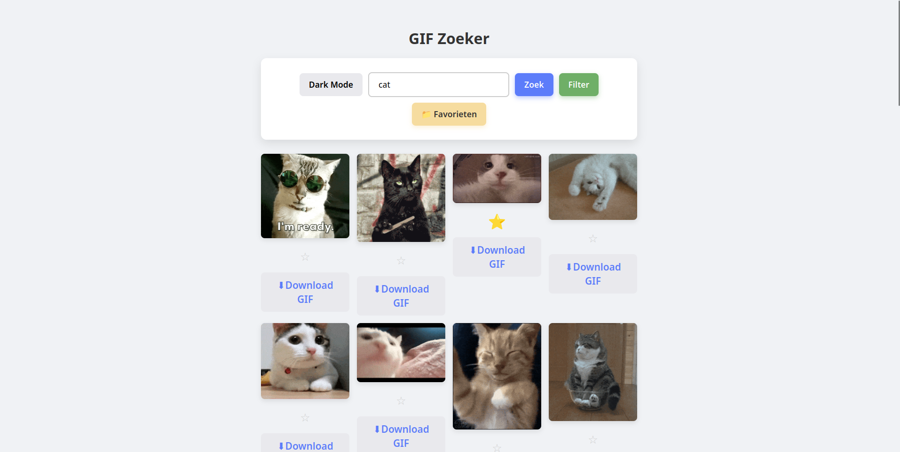

# 📁 GIF Zoeker – Web Advanced Project

## 📌 Projectbeschrijving

Deze Single Page Webapplicatie laat gebruikers toe om GIFs te zoeken via de Giphy API. De gebruiker kan:

- Zoeken op trefwoord of filteren op thema’s (zoals emoties, sport, celebrities...)
- GIFs toevoegen aan favorieten (met opslag in `localStorage`)
- GIFs downloaden
- De interface wisselen tussen dark mode en light mode
- Navigeren tussen "Zoeken" en "Favorieten" via een hash-gebaseerde router
- GIFs automatisch laten animeren bij scrollen via de IntersectionObserver API

## ✨ Functionaliteiten

- 🔍 Zoekfunctie op trefwoord
- 🧠 Filtersysteem op populaire categorieën
- ⭐ Favorieten opslaan met localStorage
- 🌙 Donkere modus + voorkeur onthouden
- 📥 GIFs downloaden
- 🔗 Hash-gebaseerde router (SPA)
- 👁️ Observer API voor scroll-animatie van GIFs
- 📱 Responsive design en toegankelijke layout

## 🔗 Gebruikte API's

- **Giphy API**
  - Website: [https://developers.giphy.com/](https://developers.giphy.com/)
  - Endpoint: `https://api.giphy.com/v1/gifs/search`

## 🛠️ Technische vereisten – Implementatie in de code

| Concept                         | Bestand     | Regels |
|---------------------------------|-------------|--------|
| API-integratie (`fetch`)        | `main.js`   | 65, 89, 92, 122, 159 |
| DOM manipulatie                 | `main.js`   | 2–254 |
| Template literals               | `main.js`   | 71, 90, 110 |
| Array methods (`map`, etc.)     | `main.js`   | 20, 95 |
| Arrow functions                 | `main.js`   | o.a. 20, 86, 127, 263 |
| Ternary operator                | `main.js`   | 41, 90, 221 |
| Callback functions              | `main.js`   | 86, 264 |
| Promises (`.then()`)            | `main.js`   | 66–67 |
| Async & Await                   | `main.js`   | 89 |
| Observer API (`IntersectionObserver`) | `main.js` | 262–264 |
| LocalStorage                    | `main.js`   | 23, 27, 221, 226, 252 |
| Formulier validatie             | `main.js`   | 109, 119 |
| Hash-router (`SPA`)             | `main.js`   | 250 |
| Downloadfunctionaliteit         | `main.js`   | 52–64 |

## ⚙️ Installatiehandleiding

1. **Clone de repo**  
   bash
   git clone <https://github.com/nohm9n/GIFzoeker>
   cd opdracht
   

## 🖼️ Screenshots

## 📚 Gebruikte bronnen

- [Giphy API Docs](https://developers.giphy.com/docs/api/)
- [Vite](https://vitejs.dev/)
- [MDN Web Docs](https://developer.mozilla.org/)
- ChatGPT (OpenAI) voor hulp bij technische implementatie, README , routering en observer logica
- Eigen leerstof en opdrachten van Web Advanced

